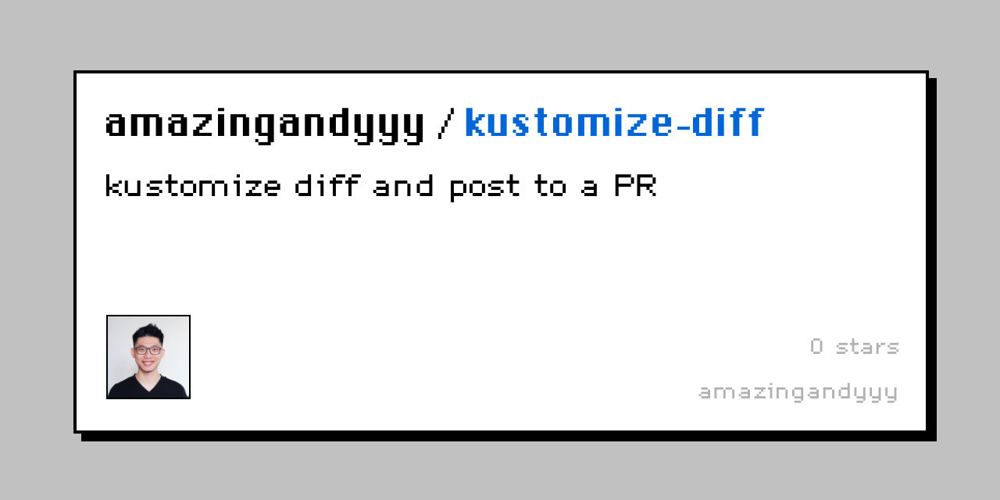

<p styles="font-size: 20rem" align="center">
    
</p>
<h1 align="center">
kustomize-diff
</h1>
<h4 align="center">
Kustomize diff github action
</h4>

## Installation

## Usage

```yaml
name: Release

on:
  push:
    branches: [main]
  workflow_dispatch:

jobs:
  release:
    runs-on: ubuntu-latest
    steps:
      - uses: actions/checkout@v3
      - name: kustomize diff
        id: kustomize-diff
        uses: amazingandyyy/kustomize-diff@latest
        env:
          GITHUB_TOKEN: ${{ secrets.GITHUB_TOKEN }}
```

## Development

### Initialization

```sh
git clone https://github.com/amazingandyyy/kustomize-diff.git
cd kustomize-diff
./scripts/setup
```

### Trigger pre-commit hook manually

```sh
pre-commit run --all-files
```

---



## Contribution

- Try out this tool
- Star this repo
- Share with your friend!
- [Create issue](https://github.com/amazingandyyy/kustomize-diff/issues/new)
- Create PRs

## Resources

- [[How We Write Actions in Go](https://full-stack.blend.com/how-we-write-github-actions-in-go.html#releasing)](https://github.com/sethvargo/go-githubactions)

## LICENSE

[MIT](LICENSE)
